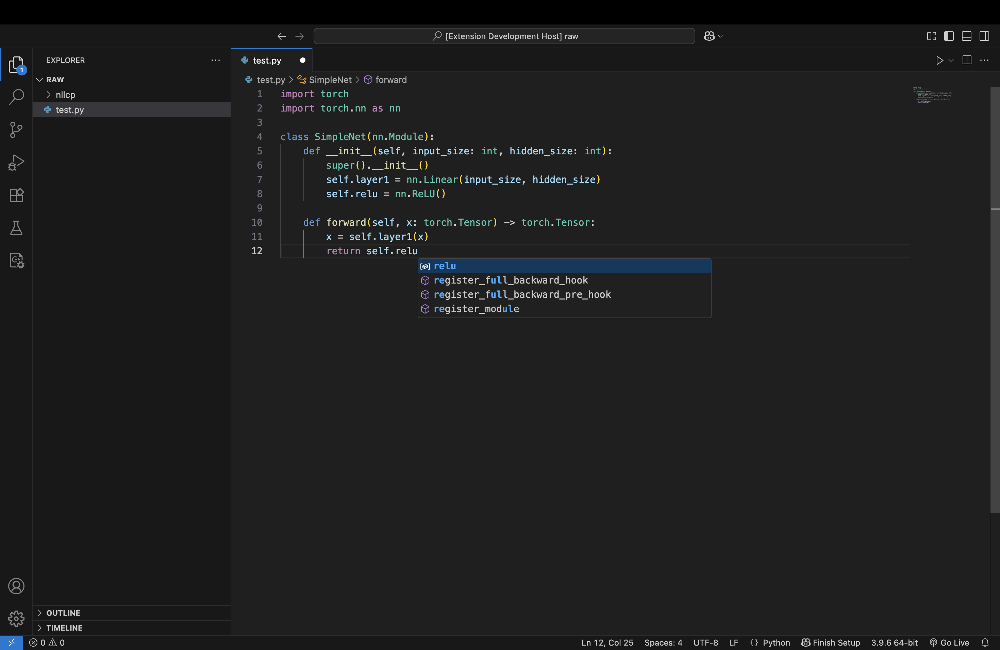

# 🚀 SSL-For-Code: Learning a Code Language Model for Python Code

🎯 **Boost your Python coding productivity by up to 50% with AI-powered autocompletion!**

This project showcases the application of deep learning to enhance Python code autocompletion, significantly boosting developer productivity by reducing keystrokes. Leveraging LSTM and Transformer models, it predicts Python code completions and seamlessly integrates with a VSCode extension for an intuitive coding experience.

## ✨ Key Features

- 🧠 **Deep Learning Models**: Train LSTM and Transformer models tailored for Python code autocompletion.
- 🔤 **Character-Level Processing**: Utilizes character-level modeling for simplicity and effectiveness.
- ⚡ **High Efficiency**: Achieve up to 50% keystroke savings for Python developers.
- 🔌 **VSCode Integration**: Real-time autocompletion suggestions within VSCode.
- 📊 **Easy Training**: Simplified model training and evaluation with user-friendly Python scripts.
- 🎛️ **Customizable**: Experiment with different architectures and hyperparameters.

## 📁 Directory Structure

```
SSL-For-Code/
├── 📄 LICENSE
├── 🔧 Makefile
├── 📖 README.md
├── 📋 requirements.txt
├── ⚙️ setup.py
├── 💾 data/
│   ├── 🗂️ cache/
│   └── 📄 pytorch_awesome.md
├── 📚 docs/
│   ├── 📊 Project-Presentation.pdf
│   └── 📋 Project-Proposal.pdf
├── 🖼️ images/
│   └── 🎨 vscode-attention.png
├── 🧠 ssl_for_code/
│   ├── 🐍 __init__.py
│   ├── 📦 bundle.py
│   ├── 🗃️ create_dataset.py
│   ├── 🌐 distributed.py
│   ├── 🖥️ server.py
│   ├── 🎓 train.py
│   ├── 📊 dataset/
│   │   ├── 🐍 __init__.py
│   │   ├── 🔤 bpe.py
│   │   ├── 📝 break_words.py
│   │   └── 💾 dataset.py
│   ├── 🧪 evaluate/
│   │   ├── 🐍 __init__.py
│   │   ├── 🔍 anomalies.py
│   │   ├── 🔍 beam_search_lengthy.py
│   │   ├── 🔍 beam_search.py
│   │   ├── 📊 eval_sample.py
│   │   ├── 🏭 factory.py
│   │   └── 🎯 generate.py
│   └── 🤖 models/
│       ├── 🐍 __init__.py
│       ├── 🛣️ highway.py
│       ├── 🔄 lstm.py
│       ├── 🔄 transformer.py
│       └── 📈 xl.py
└── 🔌 vscode_extension/
    ├── ⚙️ editor-settings.json
    ├── 📦 package-lock.json
    ├── 📄 package.json
    ├── 🔧 tsconfig.json
    ├── 📚 node_modules/
    │   └── [dependency packages]
    ├── 📤 output/
    │   ├── 🔗 extension.js
    │   └── 🗺️ extension.js.map
    └── 💻 src/
        └── 🔌 extension.ts
```

## 🚀 How to Run This Project

1. **📥 Clone the Repository & Navigate**  
   Clone the repository to your local machine and navigate to the project directory:  
   ```bash
   git clone https://github.com/Nikhil-1920/SSL-For-Code.git
   cd SSL-For-Code/
   ```

2. **📦 Install Requirements**  
   Install the necessary dependencies listed in the `requirements.txt` file:  
   ```bash
   pip install -r requirements.txt
   ```

3. **🗃️ Create the Dataset**  
   The dataset, compiled from Python code in repositories listed in the Awesome PyTorch list, is essential for training. Generate it with:  
   ```bash
   python3 ssl_for_code/create_dataset.py --num-repos [1 ... N]
   ```

4. **🔤 Create the BPE Cache**  
   To create the Byte Pair Encoding (BPE) cache for efficient tokenization and preprocessing of the dataset, run:  
   ```bash
   python3 ssl_for_code/dataset/bpe.py
   ```

5. **🎓 Train the Model**  
   With the dataset ready, train the model using the training script:  
   ```bash
   python3 ssl_for_code/train.py
   ```

6. **🔌 Set Up the VSCode Extension**  
   To integrate the trained model with VSCode for autocompletion:  
   - 📱 **Install Node.js**: Ensure Node.js is installed on your system for running the extension.  
   - 📦 **Install npm dependencies**: Navigate to the frontend directory and install dependencies:  
     ```bash
     cd vscode_extension
     npm install
     ```

7. **🖥️ Start the Python Server**  
   The VSCode extension relies on a Python server. Launch it with:  
   ```bash
   python3 ssl_for_code/server.py
   ```

8. **💻 Open the VSCode Extension**  
   Open the `vscode_extension/` folder in VSCode:  
   ```bash
   cd vscode_extension/
   code .
   ```

9. **▶️ Run the Extension**  
   In VSCode, go to `Run > Start Debugging` to launch the extension in a new VSCode window.

10. **🎯 Start Coding (for Testing)**  
    Open or create a Python file in VSCode. As you type, the extension will suggest completions based on the trained model.

11. **🔧 Experiment with Hyperparameters**  
    Customize the model by adjusting hyperparameters:  
    - Modify the number of layers or dimensions of the LSTM/Transformer model in `train.py`.  
    - Experiment with learning rate, batch size, and training epochs to optimize performance.

## 🎬 Project Working

<p align="center">
  
</p>

## 🤝 Contributing

Contributions are welcome! Please feel free to submit a Pull Request. For major changes, please open an issue first to discuss what you would like to change.
